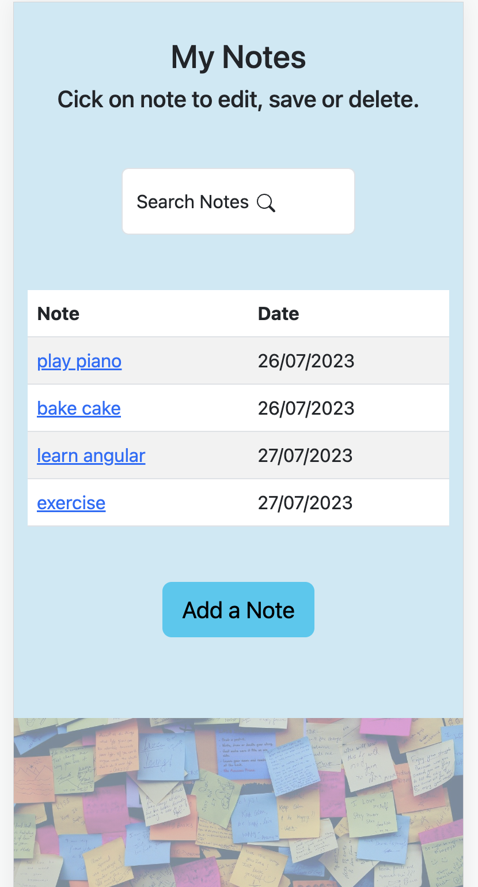
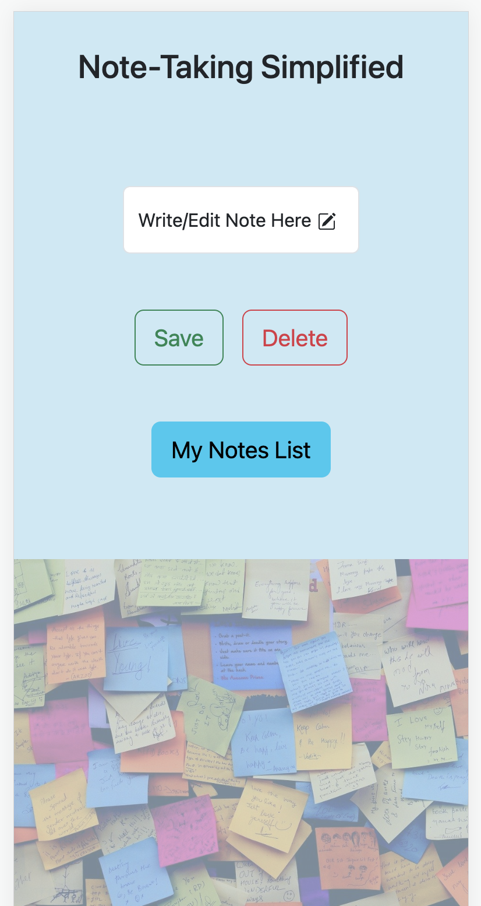

Note-Taking Simplified.

Note-Taking is a mobile-first frontend app that allows users to create, modify, delete and display their notes. The migrations, api and database folders exist to easily convert this to a fullstack app.

Architecture:  
Frontend: Next.js 13 as the frontend framework to build our web app.  

Technologies Used:

- Next.js
- TypeScript / JavaScript
- React
- Bootstrap

Visual Design of App:

Landing page/Notes List:
 

Create new notes/edit page:
 

